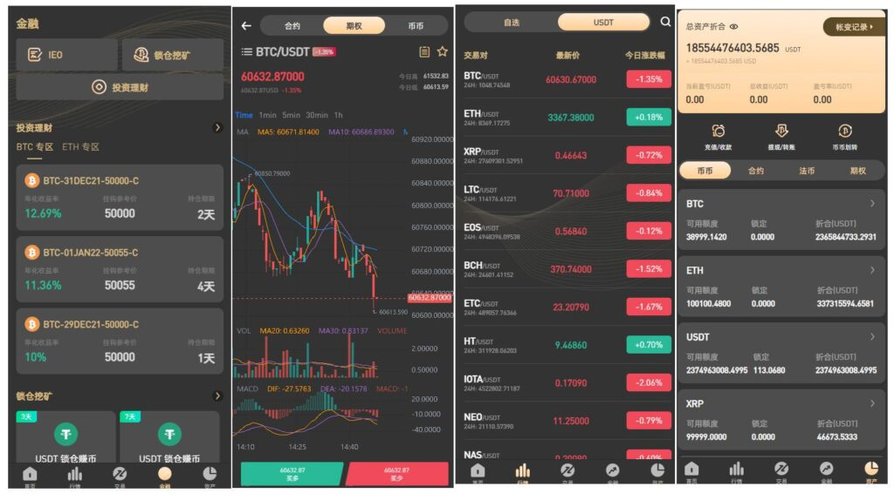

# 一套面向多端发布的数字资产交易与金融业务前后端工程


<p align="center">
  
</p>


<p align="center">
  数字资产交易系统
</p>


<p align="center">
  <a href="LICENSE"></a>
  <a href="https://github.com/bizzancoin/Blockchain_Exchange_PHP.UNIAPP/stargazers"></a>
</p>

<p align="center">
  <a href="./README-en.md">English</a> | <a href="./README.md">简体中文</a>
  <br/>
</p>


### 2026-6-3

- 新增数据库sql文件`test123.sql`


## 项目简介

本项目是基于 **Laravel 5.5** 的数字货币交易与资产管理系统，业务侧覆盖 **币币/合约相关交易、钱包充提、法币/C2C 撮合、杠杆与跟单、秒合约（Micro Trade）、双币理财、NFT 盲盒、保险与质押（锁仓）** 等模块；同时提供 **运营后台（`/admin`）**、**代理商后台（`/agent`）** 以及一套精简的 **新管理入口（`/manages`）**。

场景： **中心化交易所类 Web 后端**，前端为 H5/App 通过 `api/*` 接口与 Session/Token 鉴权交互。

### 免费的全网真完整全开源运营版

---

## 技术栈

| 类别 | 实际使用 |
|------|--------------------------------|
| **后端框架** | Laravel `5.5.*` |
| **编程语言** | PHP `>=7.0.0` |
| **数据库** | **MySQL** |
| **ORM** | Laravel Eloquent |
| **缓存** | 默认驱动为 **Redis** |
| **搜索引擎** | **Elasticsearch 6.x** |
| **实时 / 长连接** | **Workerman** |
| **HTTP 客户端** | Guzzle 6 |
| **邮件** | PHPMailer |
| **Excel** | Maatwebsite Excel 2.x |
| **数据库工具** | Doctrine DBAL |
| **前端资源构建（后台静态资源）** | Laravel Mix + Webpack |
|                                  |                       |

---

## 项目特性

以下为根据 **`routes/*.php`、控制器目录、`app/Console/Kernel.php`、`app/Jobs/`** 等归纳的真实能力（非业务承诺，以实际启用配置为准）：

- **用户体系**：注册/登录/密码找回、实名认证、安全中心（手势/支付密码/手机邮箱）、多语言（`resources/lang` 含 zh、en、hk、jp 等）。
- **API 鉴权**：`check_api` 中间件基于 **Token** 校验用户（`app/Http/Middleware/CheckApi.php`、`App\Token`）。
- **钱包与资产**：多币种钱包、充币地址、提币、闪兑、划转、账单与各类日志接口（`Api\WalletController` 等）。
- **币币交易**：委托、成交、撤单、自选（`TransactionController`、`OptionalController`）。
- **杠杆交易**：下单、平仓、批量平仓、止盈止损等（`Api\LeverController`，后台 `Admin\LeverTransactionController` 等）。
- **法币 / C2C**：商家发布、订单流转、申诉与后台审核（`LegalDealController`、`C2cDealController` 及对应 Admin）。
- **行情与 K 线**：行情接口、多周期 K 线、Elasticsearch 相关行情写入/导入命令（如 `ImportMarketFromEsearch`、`MarketHour`）。
- **秒合约（Micro Trade）**：下单、列表、结果查询等（`Api\MicroOrderController`、`app/Logic/MicroTradeLogic.php`），异步任务 `Jobs/HandleMicroTrade.php` 等。
- **跟单**：跟随、取消、交易员详情与历史（`Api\FollowController`），定时任务 `follow`（`app/Console/Kernel.php`）。
- **双币理财**：产品列表与申购（`Api\DualController`，后台 `Admin\DualController`）。
- **NFT 盲盒**：盲盒、艺术家、竞拍、质押等（`Api\BindBoxController`，后台 `Admin\BindBoxController`）。
- **保险**：投保、理赔、解约（`Api\InsuranceController`，后台规则与订单管理）。
- **质押 / 锁仓 / 银行类理财**：`Api\BankController`、`LhDepositOrder` 模型及后台 `BossController` 等。
- **站内信 / 聊天**：`Api\ChatController`。
- **新闻 / FAQ / 运营页**：`Api\NewsController`。
- **后台权限**：管理员、角色、权限模块（`Admin\AdminController`、`AdminRoleController`、`AdminRolePermissionController`）。
- **代理商体系**：独立登录与统计、团队订单（`routes/agent.php`，`Agent\*` 控制器）。
- **定时任务**：调度定义于 `app/Console/Kernel.php`（当前启用示例：`follow`、`remove_queue`、`lhdispatch_interest`；文件中另有大量已注释的历史调度，部署时需对照现场是否恢复）。
- **队列任务**：`app/Jobs` 含杠杆、行情、微单、跟单处理等（默认队列驱动见下文环境变量；`sync` 时同步执行）。

---

## 启动入口与进程

| 类型 | 路径 / 命令 |
|------|-------------|
| **HTTP（网站与 API）** | `public/index.php`（通过 Web 服务器指向 `public`） |
| **CLI** | 项目根目录 `artisan`（`php artisan`） |
| **WebSocket / Workerman（行情等）** | `public/start.php`（注释说明使用 `php start.php start`；脚本内引用 `public/mobile/chat/gateway/start*.php`，若目录缺失需在部署环境补齐或调整路径） |
| **Socket.IO 示例（vendor 内）** | `public/vendor/webmsgsender/start*.php`（第三方示例，是否与线上一致以运维为准） |

---

## API 与路由结构说明

路由由 `app/Providers/RouteServiceProvider.php` 加载四组文件：

1. **`routes/web.php`**（中间件组 `web`）  
   - 承载 **绝大多数面向客户端的 HTTP API**，路径以 **`/api/...`** 为主（如 `/api/user/login`），并包含 **`/admin/*` 后台登录与业务路由**（需 `admin_auth`）、部分 **`/winadmin`** 等。  
   - 大量接口使用中间件：`check_api`、`lang`、`XSS`、`demo_limit`、`validate_locked` 等（见 `app/Http/Kernel.php`）。

2. **`routes/api.php`**（前缀 **`api`** + 中间件组 `api`）  
   - 体量较小，例如汇信相关、`currency/match_price`、`lh/deposit` 等；完整 URL 形如 **`/api/...`**（与 `web.php` 中的 `/api/...` 并存，注意勿重复冲突）。

3. **`routes/agent.php`**（中间件组 `web`）  
   - 代理商登录、统计、订单与用户管理（前缀多为 **`/agent/...`**）。

4. **`routes/manages.php`**（中间件组 `web`）  
   - 新后台登录 **`manages/login`**、主页 **`manages/index`** 等（中间件当前路由组内为空数组，权限需后续收紧）。

**鉴权摘要**：  
- 用户 API：`Token` + `check_api`。  
- 管理端：`AdminAuthenticate`（`admin_auth`）。  
- 代理端：`AgentAuth`（`agent_auth`）。

---

## 定时任务（Cron）

在服务器 crontab 中需配置（示例）：

```bash
* * * * * cd /path/to/project && php artisan schedule:run >> /dev/null 2>&1
```

具体调度逻辑见 **`app/Console/Kernel.php`** 中 `schedule()`。

---

## Artisan 命令（节选）

自定义命令位于 **`app/Console/Commands/`**，并在 `app/Console/Kernel.php` 的 `$commands` 中注册部分命令，例如：`LHDisptchInterest`、`RemoveQueue`、`FollowCommand`（对应调度中的 `follow`、`remove_queue`、`lhdispatch_interest`）等；另有大量行情同步、钱包、杠杆、C2C 等相关命令文件，是否启用取决于调度与手动运维。

使用方式：`php artisan list` 查看全部命令。

---

## 项目目录结构

```bash
woo.worldbrcoin.xyz/
├── app/                          # 应用核心
│   ├── Console/                  # Artisan 命令与 Kernel（调度）
│   ├── Http/
│   │   ├── Controllers/
│   │   │   ├── Api/              # 移动端 / 开放 API 控制器
│   │   │   ├── Admin/            # 运营后台
│   │   │   ├── Agent/            # 代理商后台
│   │   │   ├── Manages/          # 新管理端（精简）
│   │   │   └── Auth/             # Laravel 认证脚手架
│   │   └── Middleware/           # 鉴权、跨域、XSS、风控等中间件
│   ├── Jobs/                     # 队列任务（行情、杠杆、微交易等）
│   ├── Logic/                    # 复杂业务逻辑（如 MicroTrade、CoinTrade）
│   ├── Service/                  # 如 RedisService
│   ├── Utils/                    # 工具与 Workerman 回调等
│   └── *.php                     # Eloquent 模型（大量业务表模型位于 app 根命名空间）
├── bootstrap/                    # 框架启动与缓存
├── common/
│   └── functions.php             # 全局函数（Composer autoload files）
├── config/                       # 数据库、缓存、队列、ES、短信、WebSocket 等配置
├── database/
│   ├── migrations/               # 数据库迁移（含 jobs/failed_jobs 等）
│   └── seeds/                    # 数据填充（若有）
├── public/                       # Web 根目录：index.php、静态资源、上传目录、Workerman 启动脚本
├── resources/
│   ├── lang/                     # 多语言
│   └── views/                    # Blade（后台与管理端页面）
├── routes/
│   ├── web.php                   # 主业务与大部分 API、Admin 路由
│   ├── api.php                   # 前缀 /api 的少量路由
│   ├── agent.php                 # 代理商路由
│   └── manages.php               # Manages 新后台路由
├── storage/                      # 日志、缓存、会话、编译视图（runtime）
├── tests/                        # PHPUnit
├── artisan                       # CLI 入口
├── composer.json                 # PHP 依赖与安装脚本
├── package.json                  # 前端构建（Laravel Mix）
└── Laravel5/                     # 仓库内附带的另一套 Laravel 示例/备份（与根目录主应用并行存在，部署时请勿混淆）
```

---

## 本地开发与环境安装（概要）

```bash
# PHP 依赖
composer install

# 复制环境配置（建议以根目录 .env 为准；可参考 Laravel5/.env.example）
# 配置数据库、Redis、ES 等后：
php artisan key:generate
php artisan migrate

# 前端资源（如需编译后台前端资源）
npm install
npm run dev    # 或 npm run production
```

队列与 Redis：若 `.env` 中 `QUEUE_DRIVER=redis`，需额外运行 `php artisan queue:work`。缓存依赖 Redis 时，请确保 Redis 可用。

---

## 部署与运维提示

- **部署文档** 文档根目录指向。  

---

## 打赏

如果该项目对您有所帮助，希望可以请我喝一杯咖啡☕️

```bash
# USDT-TRC20打赏地址:
TTz4y9EE5DqtRAneK5iQtWNW4k9E888888
```


## 声明

源码仅用于学习交流使用！

不可用于任何违反中华人民共和国(含台湾省)或使用者所在地区法律法规的用途。

因为作者即本人从未参与用户的任何运营和盈利活动。 

且不知晓用户后续将程序源代码用于何种用途，故用户使用过程中所带来的任何法律责任即由用户自己承担。            

```
！！！Warning！！！
项目中所涉及区块链代币均为学习用途，作者并不赞成区块链所繁衍出代币的金融属性
亦不鼓励和支持任何"挖矿"，"炒币"，"虚拟币ICO"等非法行为
虚拟币市场行为不受监管要求和控制，投资交易需谨慎，仅供学习区块链知识
```
